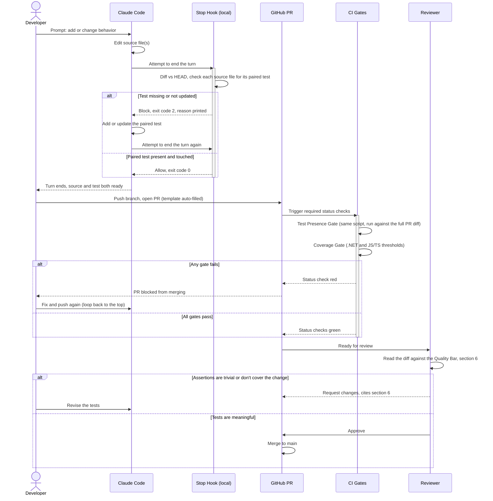

# AI-Generated Testing Standard
### Making AI-generated unit, integration, and functional tests the default — SDLC Level 2

**Owner:** Jocelyn Lefrancois
**Status:** Draft for review
**Applies to:** All product teams writing unit, integration, or functional tests (.NET/C# and JavaScript/TypeScript stacks covered explicitly; the pattern generalizes to any stack)

---

## How it actually works, in one page

Six things reference the same rule. Each one catches a different way "add tests" can quietly not happen:

| Piece | What it is | Runs when | What it stops |
|---|---|---|---|
| DoD line (§3) | A checklist item on the story | Story close-out | A story marked "done" with no test |
| `generate-tests` skill / CLAUDE.md instructions | Guidance an AI tool *chooses* to follow | Whenever the model decides to run it (or is told to) | Nothing by itself — see below |
| Stop hook, local (§5a) | A script Claude Code runs automatically before it's allowed to end a turn | Every turn, unconditionally | A coding session ending with an untested change |
| CI Test Presence Gate (§5a) | The same script, run again against the PR's full diff | Every PR | A PR merging with an untested change — even one that never went through an AI tool at all |
| Coverage gate (§5b) | A threshold the test runner itself enforces | Every PR | Coverage quietly dropping, even if a test technically exists |
| PR template + reviewer (§4, §6) | A checklist plus an explicit "don't approve" instruction | Every PR review | Tests that exist and pass but don't actually assert anything meaningful |

### Start to finish, as a sequence

Same information as the table above, but as a timeline — useful for seeing exactly where a change can get bounced back, and how many times, before it reaches `main`. (GitHub renders this diagram directly in the file — no extra tooling needed to view it.)



Everything above the reviewer's step is **presence** — automated, and only checking that a test exists and was paired with the right file. The reviewer reading against the Quality Bar (§6) is the only **quality** check in the whole flow, and nothing upstream of it can substitute for it.

### Why a SKILL.md (or a CLAUDE.md instruction) alone isn't enough

A skill is something the AI does because it chose to. That's real value — it shapes *how well* the tests get written — but on its own it has three gaps a script doesn't:

- **It only runs if invoked.** Proactively by the model, or via a slash command. Nothing forces that to happen, and a distracted or context-limited session can simply skip it.
- **It can't verify anything after the fact.** No exit code, nothing that blocks the turn or the merge if it didn't run.
- **It doesn't cover non-AI changes.** A human editing code by hand, a different tool, or a direct push never sees the skill at all.

That's why the Stop hook and the CI gate exist as a second, independent layer underneath it: plain scripts with real exit codes, running outside the model's control, checking the actual `git diff` rather than trusting that guidance was followed. The skill is the "how to do it well" layer; the hook and CI gate are the "it happened, period" layer — and only the second one is unskippable.

---

## Pick what to turn on — this is a menu, not a mandate

Every repo is different, and none of the pieces above depend on all the others being present. Turn on whichever fit your repo's risk and the team's tolerance for friction — adopting one or two is still a real improvement over adopting none. "Level 2" (the ladder below) specifically means *all three anchors are live together*; nothing requires a repo to reach Level 2 to benefit from part of this.

| Component | What you (the repo owner) decide | Where you set it | Minimal steps to turn it on, by itself | If you skip it |
|---|---|---|---|---|
| DoD line (§3) | Exact wording; whether it's repo-wide or per-story | Jira/Azure Boards template | Paste the line from §3 into your team's DoD template. No code change, nothing to merge. | No standing reminder — relies entirely on people remembering |
| PR template block (§4) | Wording; which exceptions are listed | `.github/pull_request_template.md` | Create that file if it doesn't exist, paste the block from §4 in. One file, no CI. | No forcing function for reviewers to look for tests |
| Stop hook, local (§5a) | On/off; the escape hatch (`SKIP_TEST_GATE=1`); which file extensions/naming pattern count as "source" vs. "test" | `.claude/settings.json` (registers it), `check_test_pairing.py`'s `SOURCE_EXTENSIONS` and `test_name_patterns()` | Copy `.claude/hooks/check-tests.sh` and `check_test_pairing.py` from this repo into yours; copy the `hooks.Stop` block from `.claude/settings.json` §Appendix step 7. Works with no CI change — it only affects local Claude Code sessions. | Nothing catches a missing test locally — only the CI gate (if that's on) would still catch it, later |
| CI Test Presence Gate (§5a) | Warn-only vs. a required (blocking) status check; which branches it runs on | Branch protection settings; `test-presence-gate.yml`'s `on.pull_request.branches` | Copy `check_test_pairing.py` (same file the hook above uses — copy it once, not twice) and `.github/workflows/test-presence-gate.yml`. Leave it as a normal (non-required) check first; only tick it under Settings → Branches → required status checks once it's run clean for a while. Works with no local hook installed. | A PR can merge with zero test changes |
| Coverage gate (§5b) | The threshold number; metric (line/branch/method); warn-only vs. blocking; total vs. diff coverage | `.csproj` `<Threshold>` / `jest.config.js` or `vitest.config.ts` `coverageThreshold`; branch protection | Measure your current coverage first (don't guess), set `<Threshold>`/`coverageThreshold` at or just below that baseline, copy the matching workflow from §5b. Add as a required status check once it's been green for a bit — see §10's rollout phasing. | No floor on coverage — a paired-but-trivial test still satisfies everything else |
| Integration-test marker (§5a, "Adapting the pattern") | Which trait/category/naming convention your team already uses (xUnit `[Trait]`, NUnit `[Category]`, MSTest `[TestCategory]`, a Jest/Vitest naming convention) | `check_test_pairing.py`, once you wire it in per §5a | Not a copy-paste — a small code change to your own `check_test_pairing.py`: loosen the filename pattern, add a marker-detection function, filter with it in `main()`. §5a has the exact snippet per test library. Only worth doing once you actually have integration tests to distinguish. | Integration tests aren't told apart from unit tests by the gate at all |
| Exceptions list (§7) | Which categories are pre-approved to skip tests, beyond the default four | This document, or your repo's own copy of it | Edit §7's list (or the equivalent section in your `CONTRIBUTING.md`) to add/remove categories for your team. Text-only. | Every skip needs a one-off tech-lead conversation instead of a citable rule |

**Lowest-effort starting point:** just the PR template block (§4) — a text file, no CI, no branch protection, and it still puts the question in front of every reviewer. Add the Stop hook and CI gate once the team is comfortable; those are the pieces that stop the rule depending on anyone remembering it. For a repo starting from scratch, the Appendix at the end of this document gives the same steps in a suggested full-adoption order — use it if you're taking everything, use this table if you're taking a subset.

---

## 1. Why this document exists

The task board instruction was specific: *"Default means it happens without anyone choosing to."* A practice that lives only in a wiki page, a Slack reminder, or a senior engineer's personal habit is not a default — it's a preference, and preferences decay the moment that person is busy, on vacation, or off the team. To count as SDLC Level 2 ("AI-generated tests are default, not a habit of whoever likes it"), the practice has to be anchored somewhere that fires automatically, for everyone, every time. This document names three anchors and gives the exact wording, templates, and CI configuration to install them:

1. **Definition of Done (DoD)** — the story isn't done without it.
2. **Pull request template** — the reviewer sees it and has to answer it.
3. **Build/CI gate** — the pipeline enforces it whether anyone remembers or not.

A rule anchored in only one of these is still fragile (DoD is honor-system unless a PO checks it; a PR template checkbox can be ticked without being true; a CI gate alone doesn't teach *why*). Anchored in all three, it becomes very hard to skip by accident, which is what "default" actually requires. That's the configuration this standard sets up.

A rough maturity ladder, so teams can place themselves and see the gap being closed:

| Level | State |
|---|---|
| 0 | Tests exist ad hoc, no expectation either way |
| 1 | AI-assisted test generation is *available* (tooling exists) but optional, used by whoever prefers it |
| **2** | **AI-generated tests are the default path — required by DoD, visible in the PR template, and enforced by CI** *(this document's target)* |
| 3 | Compliance is measured and reported (coverage trend, % of PRs with AI-test provenance, escaped-defect rate) |
| 4 | The standard is continuously tuned based on Level 3 data (thresholds adjusted, weak spots targeted) |

This document gets teams to Level 2 and sets up the metrics Level 3 will need, but doesn't try to solve Level 3/4 yet — get the default working first.

---

## 2. Scope and what "AI-generated" means here

**In scope:** new or materially changed unit tests, integration tests, and functional/end-to-end tests written with AI assistance (Claude Code, Copilot, or any org-approved AI coding tool) as the *first draft*, for any pull request that changes application source code.

**Not in scope / exempt by default:** pure documentation changes, config-only changes with no logic branches, generated code (e.g., scaffolds, migrations) that has no independent logic to test, and hotfixes under the incident process (see §7, Exceptions).

**What "AI-generated" does *not* mean:** tests an engineer pastes from AI output and merges unread. The standard is AI-generated, human-verified — the AI produces the first draft and the volume, a human confirms the assertions are actually meaningful (see §6, Quality Bar). A test suite that hits a coverage number but asserts nothing meaningful fails this standard even if a CI coverage gate is green. This is why the standard leans on three anchors instead of one: CI can check *that* a test file changed and coverage held; it can't fully check *that the test is good* — that's what the PR-template question and reviewer sign-off are for.

Deciding *which* of these anchors to actually turn on for a given repo is a separate, per-repo call — see "Pick what to turn on" above.

---

## 3. Anchor 1 — Definition of Done

Add this line to the team's DoD template (Jira "Definition of Done" panel, Azure Boards work item template, or wherever the team's DoD is codified) as a standing item on **every** story that touches application code, not just "testing stories":

> **DoD line to add:**
> `☐ Unit/integration/functional tests generated with an approved AI tool and reviewed by the author, covering the new/changed behavior. Coverage delta and rationale noted in the PR.`

Placement matters: put it in the same DoD block as "code reviewed" and "deployed to staging," not in a separate "testing" section that people skip when they're not explicitly the tester. DoD compliance is checked by whoever closes the ticket (typically the assignee, verified by the PO/tech lead at sprint review) — it is the human-process anchor, and it's the weakest of the three on its own, which is exactly why anchors 2 and 3 exist.

---

## 4. Anchor 2 — Pull request template

This is the anchor most teams underuse: a PR template isn't just documentation, it's a form the author has to fill in before anyone reviews the code, and a checkbox the reviewer has to explicitly find false before approving. Add this block to `.github/pull_request_template.md` (GitHub Actions is the CI platform in use, so this lives at the repo root/`.github/`):

```markdown
## Testing (AI SDLC Level 2)

- [ ] This PR includes unit/integration/functional tests for the new or changed behavior.
- [ ] Tests were AI-generated (Claude Code / Copilot / [approved tool]) as a first draft and reviewed by me — assertions are meaningful, not just present.
- [ ] Coverage impact: `+X% / -X% / unchanged` (from CI coverage report)
- [ ] If no tests were added, justification: _______________ (must match an approved exception in the Testing Standard §7)

**Reviewer:** do not approve if the first two boxes are unchecked and no exception is cited.
```

Two things make this anchor effective rather than theater:

- The **justification field is mandatory when tests are skipped**, not optional — an empty box with no tests and no reason is itself a review-blocking finding.
- The **reviewer instruction is explicit** ("do not approve if..."), so declining to approve isn't the reviewer being difficult, it's the reviewer following the template. This moves the norm from "nice to have" to "reviewers are expected to enforce this."

---

## 5. Anchor 3 — Build/CI gate (GitHub Actions)

CI is what makes the rule unskippable even under deadline pressure, because it doesn't care who's in a hurry. Two complementary gates, both as **required status checks** in branch protection (Settings → Branches → Branch protection rule → Require status checks to pass, select both jobs below):

### 5a. Gate: source changed without a matching test change

This directly checks the thing the DoD/PR template ask for — not a coverage *number*, but whether a test file actually moved when source did. Critically, it checks this **per file, by name pairing**, not "did some test change anywhere in the PR" — a coarser check would pass a PR that modified `Palindrome.cs` but only touched an unrelated `OtherTests.cs`, which defeats the point. That distinction matters most on **stories that only modify existing classes** rather than adding new ones: the gate has to notice that `Palindrome.cs` changed and `PalindromeTests.cs` didn't, specifically, not just that "a test file" changed somewhere.

The script that does this pairing (`check_test_pairing.py`) is checked into the repo at `.claude/hooks/check_test_pairing.py` and is **the same script the local Claude Code Stop hook uses** (see the Claude Code starter kit) — one piece of logic, run twice: once locally every time Claude tries to finish a turn, once in CI against the PR's full diff. That's deliberate: two independently-written pairing scripts would drift out of sync the first time someone tweaks a file-naming convention and only updates one of them.

```yaml
# .github/workflows/test-presence-gate.yml
name: Test Presence Gate

on:
  pull_request:
    branches: [main, develop]

jobs:
  check-test-presence:
    runs-on: ubuntu-latest
    steps:
      - uses: actions/checkout@v4
        with:
          fetch-depth: 0
      - uses: actions/setup-python@v5
        with:
          python-version: '3.x'

      - name: Check source changes have matching test changes
        run: python3 .claude/hooks/check_test_pairing.py --base origin/${{ github.base_ref }}
```

This is intentionally a *presence-and-pairing* check, not a coverage-quality check — it cannot verify the test is good, only that the right one exists and was touched. That gap is covered by human review (Anchor 2) and the quality bar in §4/§6. It also can't verify an existing test's assertions still make sense after the change (only that it was edited at all) — same limitation, same fix: a reviewer reading the diff.

**Adapting the pattern for integration tests:** teams that separate integration tests from unit tests do it differently — some suffix the file (`FooIntegrationTests.cs`), some rely entirely on a test-framework category/trait on individual methods within a file that otherwise looks like any other test file, some do both. There's no single regex this standard can hardcode for that, so this is a technique to adapt, not a convention to copy verbatim:

1. Loosen the presence pattern from an exact match (`^FooTests?\.cs$`) to a permissive one (`^Foo.*Tests?\.cs$`) so it catches both `FooTests.cs` and `FooIntegrationTests.cs` — or whatever your team's actual suffix is.
2. Within whatever file(s) that pattern finds, search the file's *content* for your test library's own category marker, to tell integration tests apart from unit tests living in the same file. What that marker looks like, and what to search for, per library:

   **xUnit** — a `[Trait]` attribute on the method:
   ```csharp
   public class CustomerServiceIntegrationTests
   {
       [Fact]
       [Trait("Category", "Integration")]
       public async Task CreateCustomer_ViaHttpApi_PersistsToDatabase()
       {
           // ...
       }
   }
   ```
   Detect with: `grep -E '\[Trait\("Category",\s*"Integration"\)\]' CustomerServiceIntegrationTests.cs` (or the equivalent `re.search` in Python).

   **NUnit** — a `[Category]` attribute:
   ```csharp
   [TestFixture]
   public class CustomerServiceIntegrationTests
   {
       [Test]
       [Category("Integration")]
       public void CreateCustomer_ViaHttpApi_PersistsToDatabase()
       {
           // ...
       }
   }
   ```
   Detect with: `grep -E '\[Category\("Integration"\)\]'`.

   **MSTest** — a `[TestCategory]` attribute:
   ```csharp
   [TestClass]
   public class CustomerServiceIntegrationTests
   {
       [TestMethod]
       [TestCategory("Integration")]
       public void CreateCustomer_ViaHttpApi_PersistsToDatabase()
       {
           // ...
       }
   }
   ```
   Detect with: `grep -E '\[TestCategory\("Integration"\)\]'`.

   **Jest/Vitest** — no built-in trait system, so use a naming convention instead, e.g. a labeled `describe` block or a comment tag:
   ```ts
   describe('Integration: customer API', () => {
     it('creates a customer via HTTP and persists it to the database', async () => {
       // ...
     });
   });

   // or, per-test:
   // @integration
   it('creates a customer via HTTP and persists it to the database', async () => {
     // ...
   });
   ```
   Detect with: `grep -E "describe\(['\"]Integration:|// @integration"`.

**Where this would actually live:** not as a one-off shell command run by hand — as a new helper function in `check_test_pairing.py` itself, next to the existing `test_name_patterns()` and `is_test_file()`, so it's the same script (and the same two callers — the local Stop hook and the CI gate) doing the checking, not a second piece of logic that can drift out of sync with the first:

```python
# Illustrative — not wired into this repo's check_test_pairing.py, since
# nothing here has an integration-test-worthy dependency yet. Shows where
# this slots into the existing script's structure.

INTEGRATION_MARKER_PATTERNS = {
    ".cs": r'\[Trait\("Category",\s*"Integration"\)\]|\[Category\("Integration"\)\]|\[TestCategory\("Integration"\)\]',
    ".ts": r"describe\(['\"]Integration:|//\s*@integration",
    ".tsx": r"describe\(['\"]Integration:|//\s*@integration",
    ".js": r"describe\(['\"]Integration:|//\s*@integration",
    ".jsx": r"describe\(['\"]Integration:|//\s*@integration",
}


def has_integration_marker(file_path: str) -> bool:
    """True if file_path's content contains this team's integration-test marker."""
    pattern = INTEGRATION_MARKER_PATTERNS.get(pathlib.PurePosixPath(file_path).suffix)
    if not pattern:
        return False
    try:
        content = pathlib.Path(file_path).read_text(encoding="utf-8", errors="ignore")
    except FileNotFoundError:
        return False
    return bool(re.search(pattern, content))
```

Then in `main()`, after finding candidate files with the loosened filename pattern (step 1 above), filter them through `has_integration_marker()` before deciding whether an integration test was actually touched — the same way `main()` already filters `universe_of_files()` through `test_name_patterns()` for the unit-test check. Both checks end up living in one script, run by both callers, which is the whole point of §5a's "one piece of logic, run twice" design.

Whoever (or whatever) is deciding "does an integration test already exist / need updating for this change" — a human reviewer, Claude Code, or a future extension of `check_test_pairing.py` as shown above — should use both steps together: the loose filename pattern to find candidate files, then the category-marker search to confirm what's actually inside them. Pick the marker that matches your team's real test library and document it in your own repo's `CLAUDE.md`/`CONTRIBUTING.md`; this is a per-team adaptation, not something to standardize company-wide the way the coverage threshold in §5b is.

### 5b. Gate: coverage threshold, per stack

Presence isn't enough on its own (a trivial no-op test would pass 5a), so pair it with a coverage floor. This is where each team sets its own number — this standard doesn't mandate a company-wide percentage, it mandates *that a number is set, enforced, and lives in one findable place per repo*. Start as **warn-only for 4–6 weeks**, then flip to blocking (see §8, Rollout).

**Design principle: put the threshold where the test tool already reads it, not in a new bespoke config file.** That way the exact same command enforces the exact same number whether it's run by a developer locally before pushing, by Claude Code, or by CI — there's no separate "CI-only" number that can drift from what people see on their own machine.

**.NET/C# (xUnit + Coverlet's built-in threshold, no third-party action needed):**

Set the threshold once, in the test project itself, so `dotnet test` enforces it everywhere it runs:

```xml
<!-- MyProject.Tests.csproj -->
<PropertyGroup>
  <Threshold>80</Threshold>            <!-- the team's chosen percentage -->
  <ThresholdType>line</ThresholdType>  <!-- line | branch | method -->
  <ThresholdStat>total</ThresholdStat> <!-- total | average | minimum, across all instrumented assemblies -->
</PropertyGroup>
```

```yaml
# .github/workflows/dotnet-coverage-gate.yml
name: .NET Coverage Gate

on:
  pull_request:
    branches: [main, develop]

jobs:
  coverage:
    runs-on: ubuntu-latest
    steps:
      - uses: actions/checkout@v4
      - uses: actions/setup-dotnet@v4
        with:
          dotnet-version: '8.0.x'

      - name: Test with coverage (fails the build below the csproj's Threshold)
        run: >
          dotnet test --configuration Release
          /p:CollectCoverage=true
          /p:CoverletOutputFormat=cobertura
```

`dotnet test` itself exits non-zero when coverage is under the `Threshold` set in the csproj — that's Coverlet's own MSBuild integration, not a separate summary/reporting action. A developer running that same command on their laptop before pushing gets the identical pass/fail a reviewer will see in CI.

**JavaScript/TypeScript (Jest or Vitest) — already single-sourced the same way:**

```json
// jest.config.js
{
  "coverageThreshold": {
    "global": {
      "branches": 70,
      "functions": 75,
      "lines": 75,
      "statements": 75
    }
  }
}
```

```ts
// vitest.config.ts
export default defineConfig({
  test: {
    coverage: {
      provider: 'v8',
      thresholds: { lines: 75, functions: 75, branches: 70, statements: 75 },
    },
  },
})
```

```yaml
# .github/workflows/js-coverage-gate.yml
name: JS/TS Coverage Gate

on:
  pull_request:
    branches: [main, develop]

jobs:
  coverage:
    runs-on: ubuntu-latest
    steps:
      - uses: actions/checkout@v4
      - uses: actions/setup-node@v4
        with:
          node-version: '20'
      - run: npm ci
      - run: npm test -- --coverage   # fails the job automatically if coverageThreshold isn't met
```

`jest --coverage` (or the Vitest equivalent) already reads `jest.config.js`/`vitest.config.ts` whether it's run locally or in CI — nothing extra to wire up beyond making the CI job a required status check.

### How each team should pick and configure their number

1. **Measure the current baseline first** (`dotnet test /p:CollectCoverage=true` or `npm test -- --coverage` with no threshold set yet) — don't guess. Set the initial threshold at or just below that baseline so the gate goes in green, not red.
2. **Set a stretch target and a date**, e.g. "70% now, 80% by end of Q1" — write both the number and the date in the repo's `CONTRIBUTING.md` or the `{{Coverage floor for this repo}}` line in `CLAUDE.md` (see the Claude Code starter kit), and bump the config file's actual number as milestones are hit. The enforced number is whatever's in the csproj/`jest.config.js` — treat the doc line as documentation of intent, not the enforcement point, and keep the two in sync.
3. **Total coverage (shown above) is the simple default** — one number for the whole project, easy to explain, easy to configure, and it's what Coverlet's `Threshold` and Jest's `coverageThreshold.global` give you out of the box. Its downside on an older codebase: it blocks a PR that adds well-tested new code to a file that's otherwise poorly covered, because the *file's* total is still low even though the *change* was fully tested.
4. **Diff/patch coverage** (only newly added or changed lines must meet the threshold) fixes that downside and is fairer for legacy repos with a lot of pre-existing debt, at the cost of more setup — it needs a tool that maps coverage data to the PR's diff (e.g., Codecov's or Coveralls' patch-coverage check, both of which integrate with GitHub status checks) rather than Coverlet's/Jest's built-in total-coverage threshold. Recommendation: **start with total coverage** (above) because it's zero extra tooling and matches this standard's other gates; a team whose legacy baseline is far below its target and finding the total-coverage gate too blunt is a good candidate to add a patch-coverage tool later — that's a per-team call, not something this standard needs to mandate.
5. **Register the coverage job as a required status check**, same branch-protection setting as the test-presence gate in §5a.

### 5c. Tightening later — provenance, not just presence

Once 5a/5b are stable, a stronger version of the same gate can check for lightweight evidence the tests were AI-drafted rather than only that tests exist — e.g., a required PR label (`ai-tests`) applied via a slash command in the approved tool, or a commit trailer like `Test-Origin: claude-code`. This isn't necessary to reach Level 2 and is called out here only so it isn't rediscovered as a surprise later: Level 2 requires tests to exist and be reviewed; verifying *how* they were produced is a Level 3 measurement question, not a Level 2 gate.

---

## 6. Quality bar for AI-generated tests

A gate that only checks "a test file changed" or "coverage number held" can be satisfied by low-value tests (asserting a mock was called, snapshotting output no one reads, testing getters/setters). Reviewers should reject tests that don't meet this bar, template checkbox or not:

- **Asserts behavior, not implementation.** Tests should break when behavior changes, not when someone renames a private variable.
- **Covers the actual change**, including at least one edge case and one failure/error path — not just the happy path the AI saw in the diff.
- **Independent and deterministic** — no shared mutable state between tests, no reliance on execution order, no real network/clock/filesystem calls in unit tests (those belong in integration tests, clearly separated).
- **Readable without the PR description** — a reviewer six months from now should understand what's being verified from the test name and body alone.
- **No disabled/skipped tests merged silently** — `.skip`/`[Ignore]` requires a linked ticket, same as any other TODO.

This section is what the PR template checkbox ("assertions are meaningful, not just present") points reviewers back to — put a link to this section directly in the PR template or CONTRIBUTING.md so it's one click away during review, not something reviewers have to remember exists.

---

## 7. Exceptions

Exceptions are for genuine cases, not a pressure valve for deadlines. Approved reasons a PR can skip test changes (must be cited in the PR template justification field):

- Documentation-only or comment-only changes.
- Config/infrastructure changes with no branching logic (e.g., a YAML value bump).
- Auto-generated code with no independent logic (migrations, generated clients) — but the code *calling* the generated client is still in scope.
- Incident hotfixes under the active incident process — a follow-up ticket to add the missing test is required within the next sprint, and the PR must link it.

Anything else routes through the normal process: if tests genuinely can't be written for a good reason not listed above, that's a conversation with the tech lead, not a self-granted exception — and it's a signal this list needs updating.

---

## 8. Roles and responsibilities

| Role | Responsibility |
|---|---|
| **Engineer (author)** | Uses the approved AI tool to draft tests alongside the code change; reviews and edits AI output before pushing — never merges unread AI output; fills in the PR template testing section honestly. |
| **Reviewer** | Enforces the PR template checklist; evaluates test *quality* against §6, not just presence; blocks approval on unjustified missing tests. |
| **Tech lead / team lead** | Owns the repo's coverage thresholds and their glide path; approves exceptions beyond §7; reviews DoD compliance at sprint boundaries. |
| **Product owner** | Confirms the DoD line at story close-out; does not accept a story as done with an unchecked/unexplained testing box. |
| **Platform/DevEx (you)** | Owns the CI workflows in §5, rolls out branch-protection changes, tracks org-wide compliance metrics (§9). |

---

## 9. Compliance metrics (sets up Level 3)

Once the three anchors are live, these are cheap to pull from GitHub and worth tracking monthly per team, not as a punitive scoreboard but to catch decay early (a team whose "% PRs with test changes" quietly drops is a team where the default stopped being default):

- % of merged PRs (with source changes) that included test changes.
- % of PRs where the testing checklist box was checked vs. an exception was cited vs. neither (the last bucket is what the CI gate in §5a should drive toward zero).
- Coverage trend per repo (not an absolute target across all repos — a trend line).
- Count of `test-presence-gate` failures per week, as a leading indicator of where the CI gate is catching real gaps.

---

## 10. Rollout plan

Flipping every gate to blocking on day one, org-wide, is the fastest way to get this standard bypassed, resented, or quietly reverted. Phase it:

1. **Weeks 1–2 — Pilot team.** Ship DoD line + PR template + both CI gates in **warn-only** mode (report but don't block) on one or two repos. Collect baseline numbers from §9.
2. **Weeks 3–4 — Tune thresholds.** Set per-repo coverage floors from the pilot's real baseline, not a guess. Fix false positives in the test-presence gate (e.g., path patterns missing a file type).
3. **Weeks 5–6 — Flip pilot to blocking.** Presence gate (§5a) and coverage gate (§5b) become required status checks on the pilot repos.
4. **Weeks 7–10 — Org rollout.** Repeat the template + PR-template rollout across remaining teams, warn-only first, each team gets 1–2 weeks of warn-only before blocking, so no team is surprised by a sudden red build.
5. **Ongoing.** Monthly review of §9 metrics; revisit thresholds quarterly; consider §5c provenance tightening once presence/quality are solid.

---

## Appendix — copy-paste checklist for a new repo

1. Add the DoD line from §3 to the team's Jira/Azure Boards DoD template.
2. Add the block from §4 to `.github/pull_request_template.md`.
3. Copy `.claude/hooks/check_test_pairing.py` from the Claude Code starter kit into the repo, and add `.github/workflows/test-presence-gate.yml` from §5a (it calls that same script — nothing to reimplement).
4. Set the repo's coverage threshold at its actual baseline (measure first, don't guess) in the csproj `Threshold` property or `jest.config.js`/`vitest.config.ts` `coverageThreshold`, and add the matching coverage workflow from §5b.
5. Enable both CI jobs as required status checks in branch protection (warn-only first — see §10).
6. Link §6 (Quality Bar) from `CONTRIBUTING.md` so reviewers have one click to it.
7. If using Claude Code, also drop in the starter kit's `CLAUDE.md`, subagent, skill, and Stop hook (`.claude/hooks/check-tests.sh`) so the same pairing check runs locally, before the PR even exists — see the kit's README for the worked example.
8. Add the repo to the monthly §9 metrics tracking.
